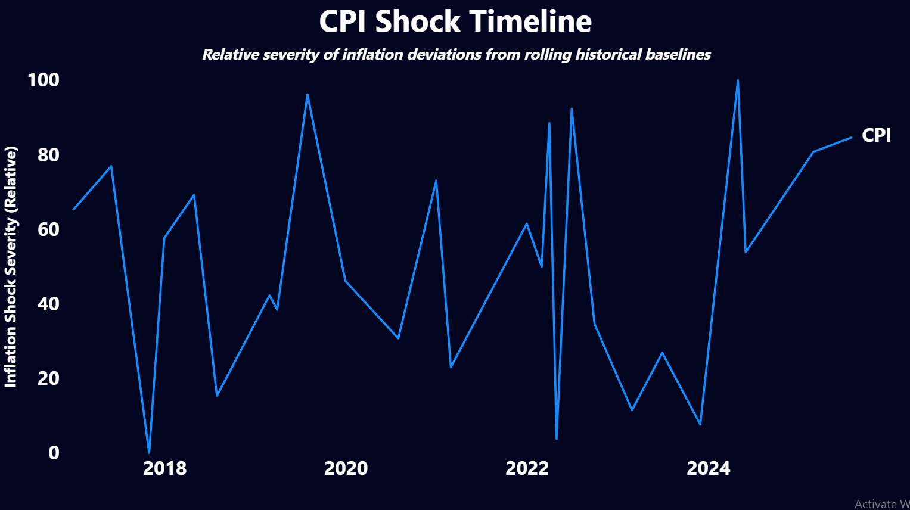
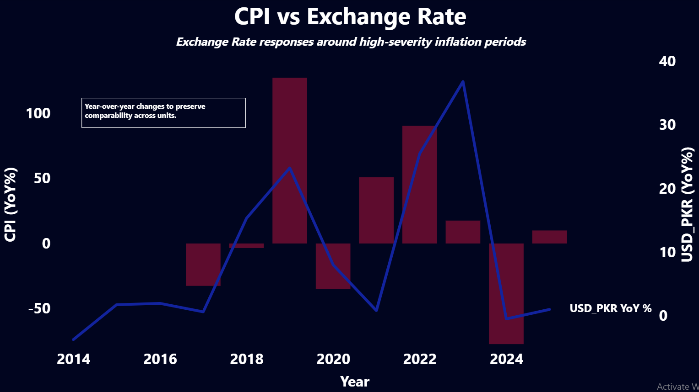
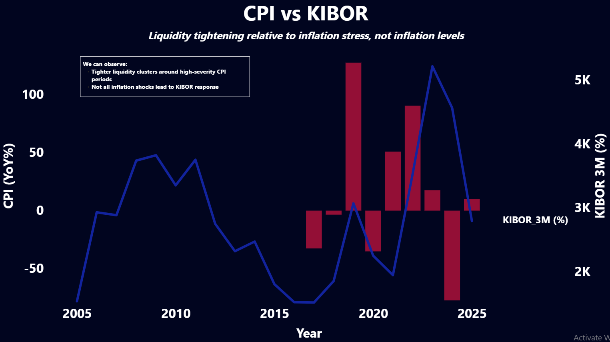

# Shock Intelligence Engine – Demo Guide

## What This Project Does

This project is a macroeconomic shock detection and interpretation system focused on Pakistan. It identifies inflation shocks relative to historical context and examines how those shocks propagate through markets, liquidity conditions, and monetary policy responses over time.

The system is designed for interpretation rather than prediction. It emphasizes severity, persistence, and timing instead of point forecasts or causal claims.

---

## How to Read the Dashboard (2-Minute Walkthrough)

The dashboard follows a deliberate narrative flow. Each visual answers a specific question.

---

### 1. CPI Shock Timeline 
*Question:* When does inflation stress meaningfully exceed historical norms?

This chart shows the relative severity of inflation deviations from rolling historical baselines. Spikes indicate periods of unusually high inflation stress, accounting for both magnitude and persistence.

This establishes the timing and intensity of macroeconomic stress.

---

### 2. CPI vs Exchange Rate 
*Question:* How do currency markets react during high inflation stress?

Both CPI and USD/PKR are shown as year-over-year percentage changes to preserve unit comparability. This view highlights how exchange rate movements cluster around high-severity inflation periods, often reacting faster and more sharply than institutional responses.

---

### 3. CPI vs KIBOR (Liquidity Stress) 
*Question:* Does inflation stress translate into short-term funding pressure?

This chart compares CPI year-over-year changes with the 3-month KIBOR rate. Liquidity tightening appears selectively and clusters around extreme inflation periods rather than responding mechanically to every inflation movement.

This suggests discretionary or threshold-based liquidity responses.

---

### 4. CPI vs Policy Rate 
*Question:* When and how do institutions respond?

Policy rate changes are infrequent and delayed relative to inflation stress. Long flat stretches indicate deliberate non-response rather than missing data. Policy actions cluster around periods of sustained and severe inflation rather than short-term volatility.

---

## What This Demonstrates

- Inflation shocks can be detected without fixed thresholds
- Markets, liquidity, and policy respond at different speeds
- Severity and persistence matter more than isolated spikes
- Inaction is often as informative as action

---

## Scope and Limitations

This system does not attempt to forecast outcomes or establish causal relationships. It is intended as a structured framework for interpreting macroeconomic stress and response dynamics.

---

## Status

The core analytical engine and dashboard are complete. Future work may include automation, extensions to additional indicators or countries, and deeper spillover analysis.